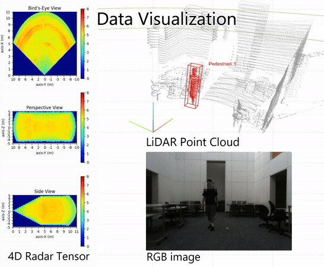
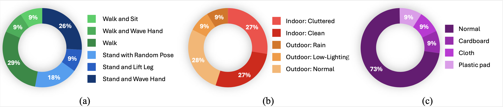
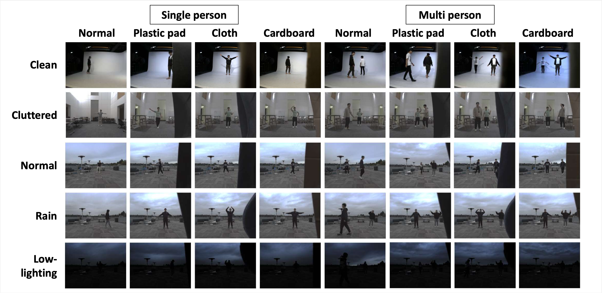

# RT-Pose: A 4D Radar Tensor-based 3D Human Pose Estimation and Localization Benchmark (ECCV 2024)
[[paper]()] [[dataset](https://huggingface.co/datasets/uwipl/RT-Pose)]
<div align="center">
    
</div>


## Abstract

Traditional methods for human localization and pose estimation (HPE), which mainly rely on RGB images as an input modality, confront substantial limitations in real-world applications due to privacy concerns. In contrast, radar-based HPE methods emerge as a promising alternative, characterized by distinctive attributes such as through-wall recognition and privacy-preserving, rendering the method more conducive to practical deployments. This paper presents a Radar Tensor-based human pose (RT-Pose) dataset and an open-source benchmarking framework. RT-Pose dataset comprises 4D radar tensors, LiDAR point clouds, and RGB images, and is collected for a total of 72k frames across 240 sequences with six different complexity level actions. The 4D radar tensor provides raw spatio-temporal information, differentiating it from other radar point cloud-based datasets. We develop an annotation process, which uses RGB images and LiDAR point clouds to accurately label 3D human skeletons. In addition, we propose HRRadarPose, the first single-stage architecture that extracts the high-resolution representation of 4D radar tensors in 3D space to aid human keypoint estimation. HRRadarPose outperforms previous radar-based HPE work on the RT-Pose benchmark. The overall HRRadarPose performance on the RT-Pose dataset, as reflected in a mean per joint position error (MPJPE) of 9.91cm, indicates the persistent challenges in achieving accurate HPE in complex real-world scenarios. 

<div align="center">
    
</div>


<div align="center">
    
</div>


RT-Pose is available on [Hugging Face](https://huggingface.co/datasets/uwipl/RT-Pose).

## Data Processing
Please check [data processing](data_processing)


## Baseline Method and Evaluations


### Installation

We recommend using conda to manage the Python environment:

``` bash
conda create -n rt_pose python=3.9 -y
conda activate rt_pose
pip install -r requirements-torch.txt --index-url https://download.pytorch.org/whl/cu117
pip install -r requirements.txt
cd det3d/ops/dcn && python setup.py build_ext --inplace
cd ../../..
```

### Training
To train the baseline method:

```bash
python ./tools/train.py configs/<config file>
```

For more details about the command options, 
```bash
python ./tools/train.py -h
```

### Evaluations
To evaluate the baseline method:

```bash
python ./tools/test.py <config file> --checkpoint <model checkpoint> --testset
```
For more details about the command options, 
```bash
python ./tools/test.py -h
```

## License

RT-Pose is released under [CC BY-NC-SA](https://creativecommons.org/licenses/by-nc-sa/4.0/deed.en).

## Main Contributors
Yuan-Hao Ho (n28081527@gs.ncku.edu.tw), Jen-Hao(Andy) Cheng(andyhci@uw.edu)


## Citing RT-Pose

```tex

```


## Acknowlegement
Our project could not have been accomplished without leveraging several exceptional open-source codebases. 

* [centerpoint](https://github.com/tianweiy/CenterPoint/tree/master)
* [det3d](https://github.com/poodarchu/det3d)